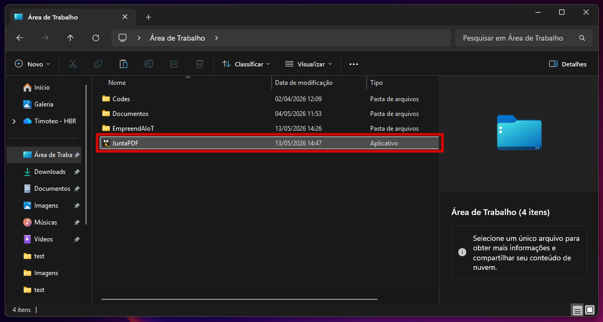
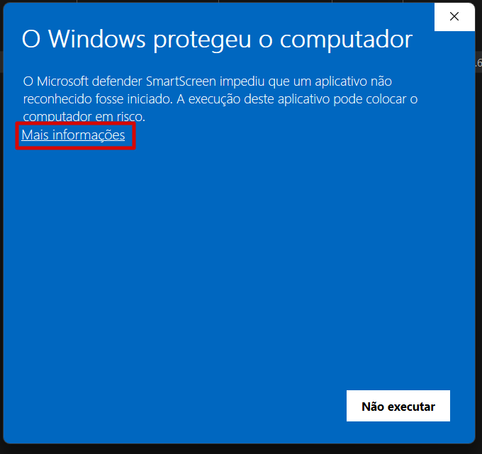
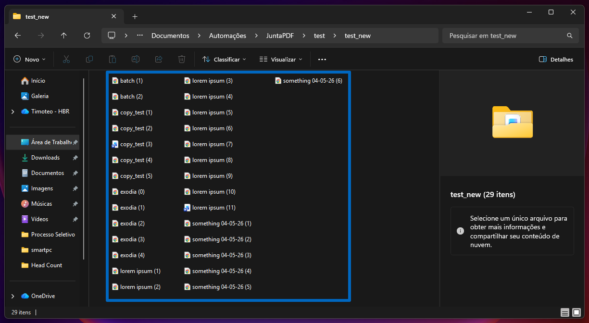
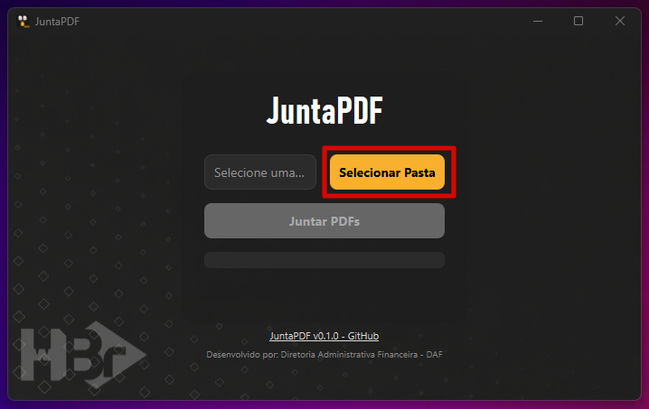
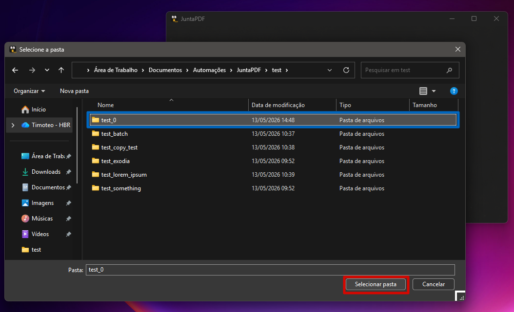
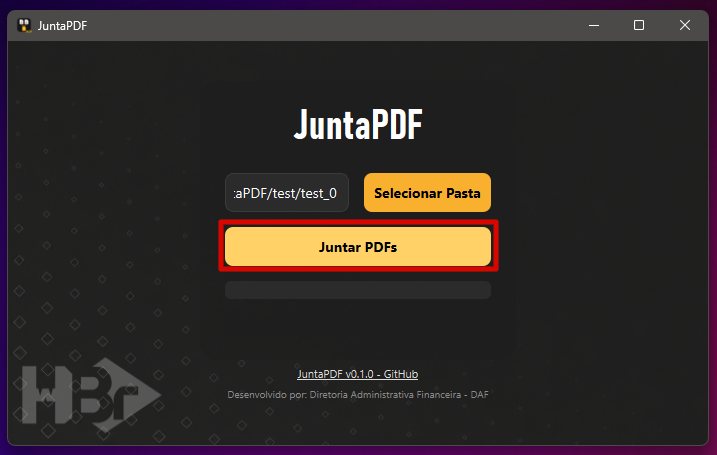
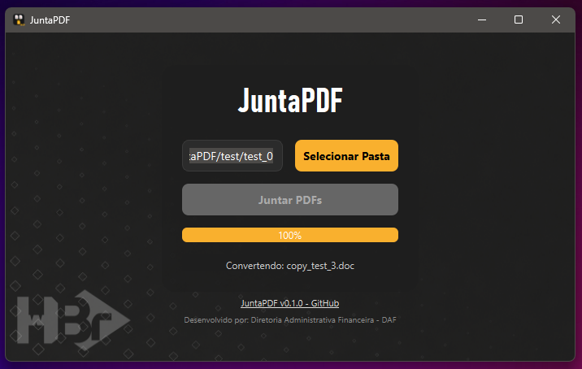
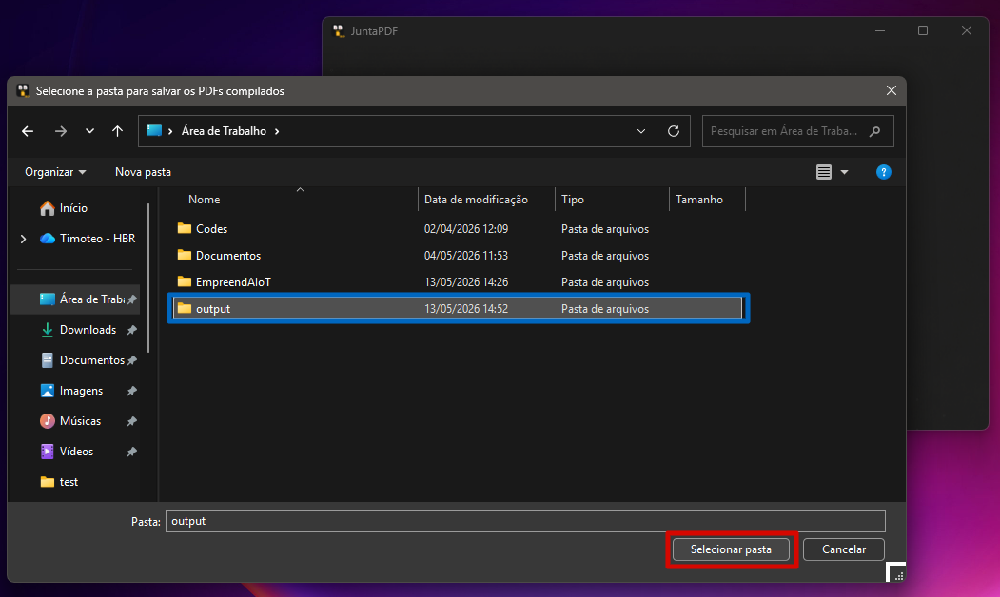
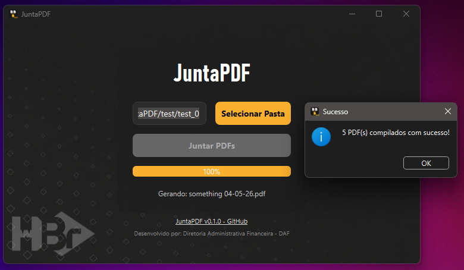
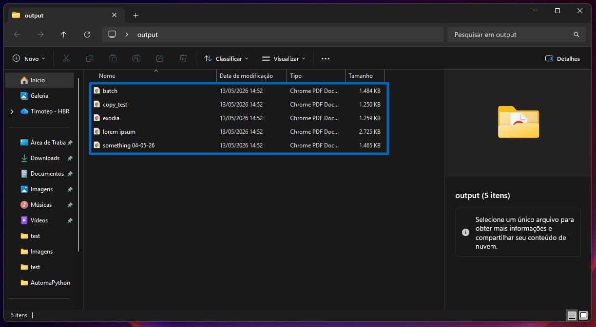

# JuntaPDF

Programa de emenda local de arquivos PDF e documentos Word (.doc e .docx) em lote.

## 1. Requisitos

Para uso adequado do programa, o usuário deve possuir:
- **Sistema Operacional:** Windows 10 ou 11

Para uso da funcionalidade de conversão `DOC/DOCX`→`PDF`, o usuário deve ter o *Microsoft Word* instalado na versão mais recente.

## 2. Guia de Uso

### 2.1 Baixando e Instalando o Programa

Para usar o `JuntaPDF`, primeiro, você deve baixar o arquivo `.exe` disponível [aqui](https://github.com/imbaTIMvel/juntapdf/releases). Procure pela versão mais recente (*Latest*) e clique no arquivo `.exe` para fazer o download.

> [!Warning]
> Caso você ainda tenha o executável de uma versão antiga do programa, recomenda-se excluí-lo.

Baixado o programa, você pode colocar o arquivo `.exe` onde achar melhor.

### 2.2 Abrindo o Programa

Feito isso, clique no arquivo `.exe` para abrir o programa.

> [!Warning]
> É possível que o *Windows Defender* acuse o programa como "software perigoso". Neste caso, para executá-lo, você deve clicar em `Mais Informações` e, depois, no botão `Executar assim mesmo`.

Antes de iniciar uma operação, junte os arquivos que você deseja emendar em uma pasta. O programa utiliza uma convenção de nomenclatura de arquivos para saber quais arquivos emendar e em que ordem fazê-lo.

### 2.3 Organizando os Arquivos de Entrada

Todos os arquivos colocados na pasta devem ser nomeados como:

`nome (x).pdf`

Sendo que:
- `nome` pode ser qualquer texto (incluindo letras maiúsculas, minúsculas, acentos, sinais e números)
- `x` **PRECISA** estar entre parênteses
- `x` deve ser um número inteiro, na ordem desejada para emenda dos arquivos do conjunto `nome`
- O conjunto de arquivos de entrada com o mesmo elemento `nome` será mesclado em um único arquivo `nome.pdf`, seguindo a ordem dos índices `x`

Para que o programa seja capaz de processá-los e emendá-los adequadamente.

Observe o exemplo:

Aqui, tenho 5 diferentes grupos de arquivos (disponíveis na pasta [test/test_0](test/test_0)):
- Grupo "batch": `batch (1).pdf`, `batch (2).pdf`
- Grupo "copy_test": `copy_test (1).pdf`, `copy_test (2).pdf`, `copy_test (3).doc`, `copy_test (4).pdf`, `copy_test (5).pdf`
- Grupo "exodia": `exodia (0).pdf`, `exodia (1).pdf`, `exodia (2).pdf`, `exodia (3).pdf`, `exodia (4).pdf`
- Grupo "lorem ipsum": `lorem ipsum (1).pdf`, `lorem ipsum (2).pdf`, `lorem ipsum (3).pdf`, `lorem ipsum (4).pdf`, `lorem ipsum (5).pdf`, `lorem ipsum (6).pdf`, `lorem ipsum (7).pdf`, `lorem ipsum (8).pdf`, `lorem ipsum  (9).pdf`, `lorem ipsum  (10).pdf`, `lorem ipsum (11).docx`
- Grupo "something 04-05-26": `something 04-05-26 (1).pdf`, `something 04-05-26 (2).pdf`, `something 04-05-26 (3).pdf`, `something 04-05-26 (4).pdf`, `something 04-05-26 (5).pdf`, `something 04-05-26 (6).pdf`

O programa reconhece o grupo do arquivo e a ordem em que ele deve ser emendado ao arquivo de saída através da nomenclatura do documento. Tomemos o arquivo `lorem ipsum (5).pdf`, por exemplo:
- Nome do arquivo (sem a extensão): `lorem ipsum (5)`
- Texto **antes** do underscore ("_"): `lorem ipsum`
- Texto **depois** do underscore ("_"): `5`
Logo, este arquivo pertence ao grupo "lorem ipsum", e é o arquivo de índice 5.

Para o conjunto de arquivos apresentados anteriormente, o programa processará os seguintes arquivos de saída:
- `batch.pdf`
- `copy_test.pdf`
- `exodia.pdf`
- `lorem ipsum.pdf`
- `something 04-05-26.pdf`

Em suma:

| Arquivos de entrada | Operação | Arquivo(s) de saída | Nota |
| ------------------- | -------- | ------------------- | ---- |
| `batch (1).pdf`, `batch (2).pdf` | Emendar na ordem: batch (1) + batch (2) | `batch.pdf` | Arquivos de entrada disponíveis em [test_batch](test/test_batch) |
| `copy_test (1).pdf`, `copy_test (2).pdf`, `copy_test (3).doc`, `copy_test (4).pdf`, `copy_test (5).pdf` | Converter `copy_test (3).doc` em `copy_test (3).pdf`. Emendar na ordem: copy_test (1) + copy_test (2) + copy_test (3) + copy_test (4) + copy_test (5) | `copy_test.pdf` | Arquivos de entrada disponíveis em [test_copy_test](test/test_copy_test) |
| `exodia (0).pdf`, `exodia (1).pdf`, `exodia (2).pdf`, `exodia (3).pdf`, `exodia (4).pdf` | Emendar na ordem: exodia (0) + exodia (1) + exodia (2) + exodia (3) + exodia (4) | `exodia.pdf` | Arquivos de entrada disponíveis em [test_exodia](test/test_exodia) |
| `lorem ipsum (1).pdf`, `lorem ipsum (2).pdf`, `lorem ipsum (3).pdf`, `lorem ipsum (4).pdf`, `lorem ipsum (5).pdf`, `lorem ipsum (6).pdf`, `lorem ipsum (7).pdf`, `lorem ipsum (8).pdf`, `lorem ipsum (9).pdf`, `lorem ipsum (10).pdf`, `lorem ipsum (11).docx` | Converter `lorem ipsum (11).docx` em `lorem ipsum (11).pdf`. Emendar na ordem: lorem_ipsum (1) + lorem_ipsum (2) + lorem_ipsum (3) + lorem_ipsum (4) + lorem_ipsum (5) + lorem_ipsum (6) + lorem_ipsum (7) + lorem_ipsum (8) + lorem_ipsum (9) + lorem_ipsum (10) + lorem_ipsum (11) | `lorem_ipsum.pdf` | Arquivos de entrada disponíveis em [test_lorem_ipsum](test/test_lorem_ipsum) |
| `something 04-05-26 (1).pdf`, `something 04-05-26 (2).pdf`, `something 04-05-26 (3).pdf`, `something 04-05-26 (4).pdf`, `something 04-05-26 (5).pdf`, `something 04-05-26 (6).pdf` | Emendar na ordem: something 04-05-26 (1) + something 04-05-26 (2) + something 04-05-26 (3) + something 04-05-26 (4) + something 04-05-26 (5) + something 04-05-26 (6) | `something 04-05-26.pdf` | Arquivos de entrada disponíveis em [test_something](test/test_something) |

### 2.4 Selecionando a Pasta

Na janela do programa, clique no botão `Selecionar Pasta` para escolher a pasta onde seus arquivos de entrada estão salvos.

### 2.5 Emendando os Arquivos

Para emendar os PDFs, clique no botão `Juntar PDFs`.

Após o processamento dos arquivos, o programa abrirá uma janela para que você escolha a pasta onde os arquivos de saída serão salvos.

## 3. Releases

### `v0.1.0` JuntaPDF (*beta release*)

> [!Warning]
> O lançamento beta (*beta release*) foi desenvolvido para **testes internos**, visando identificar e corrigir bugs antes do lançamento de uma versão estável.

Data de lançamento: `13/05/2026`

Para fazer o download desta versão, clique [aqui](https://github.com/imbaTIMvel/juntapdf/releases/download/v0.1.0/JuntaPDF.exe).

*Release* inicial do programa de emenda local de arquivos PDF e documentos Word (.doc e .docx) em lote.

**Features:**

- Recebe arquivos .pdf, juntando-os em PDFs "costurados" de acordo com a nomenclatura e numeração dos arquivos. Por exemplo:
  - Arquivos de entrada: `string1 (1).pdf`, `string1 (2).pdf`, `...`, `string1 (10).pdf`, `string2 (1).pdf`, `string2 (2).pdf`, `...`, `string2 (10).pdf`, `string3 (1).pdf`, `string3 (2).pdf`, `...`, `string3 (10).pdf`;
  - Arquivos de saída: `string1.pdf`, `string2.pdf`, `string3.pdf`
  - Onde "string1", "string2" e "string3" podem ser quaisquer strings de texto (incluindo letras maiúsculas, minúsculas, acentos, sinais e números).
- Compatível com arquivos .doc e .docx, convertendo-os em .pdf antes da mescla.
- Permite que o usuário escolha o diretório de salvamento para o(s) arquivo(s) de saída.

Clique [aqui](https://github.com/imbaTIMvel/juntapdf/releases) para acessar o **changelog completo**.

## 4. Desenvolvimento

#### Autor:

Timóteo Altoé (*handle:* [imbaTIMvel](https://github.com/imbaTIMvel))

#### Datas:

`04/05/2026` Início do projeto

`05/05/2026` Lançamento da versão *alfa* - para testes internos

`13/05/2026` Publicação da primeira versão oficial no GitHub

`21/05/2026` Lançamento da versão *beta* - para testes
